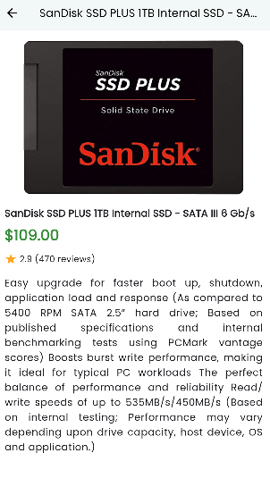

# 🛍️ E-commerce App

A modern Flutter-based mobile application that fetches and displays products from an API. The app showcases products in a responsive grid layout with dynamic images, price, title, and detailed product view including rating and description.

---

## 📱 Screenshots

### 🏞️ Home Page


### 📋 Product Details


---

# ✨ Features

- 📦 Fetches live product data from API
- 🖼️ Image caching with placeholder and error fallback
- 🔍 Tap on a product card to view detailed info
- 💅 Beautiful UI with Google Fonts & Material Design
- ⚙️ Modular and scalable code architecture
- ⚡ Fast performance with async calls and optimized layouts

---

## 🔧 Technologies Used

- Flutter
- Dart
- HTTP package
- Cached Network Image
- Google Fonts
- GetX (if used)

## 🧑‍💻 Author

**Faysal Bin Alauddin**  
📧 Email: faysalf716@gmail.com  
🔗 GitHub: [Faysal Bin Alauddin](https://github.com/faysalcsecu)  
🔗 LinkedIn: [Faysal Bin Alauddin](https://www.linkedin.com/in/faysal-bin-alauddin-4815a92a7/)


## 🛠️ Project Structure

```bash
lib/
├── core/
│   └── constants/
├── data/
│   ├── models/
│   └── services/
├── presentation/
│   ├── screens/
│   ├── widgets/
│   └── utils/
└── main.dart

## 🧑‍💻 Author

**Faysal Bin Alauddin**  
📧 Email: faysalf716@gmail.com  
🔗 GitHub: [Faysal Bin Alauddin](https://github.com/faysalcsecu)  
🔗 LinkedIn: [Faysal Bin Alauddin](https://www.linkedin.com/in/faysal-bin-alauddin-4815a92a7/)
